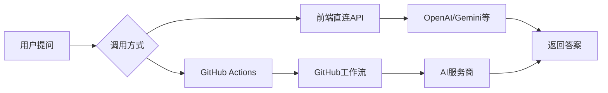

中医经方学习平台

一个基于现代Web技术和人工智能的中医经方学习平台，专注于传承和研究张仲景《伤寒杂病论》经典方剂。

🌟 项目特色

🧠 智能中医助手

· AI问答系统：集成多种大语言模型，提供专业的中医经方解答
· 多模型支持：OpenAI GPT-4、Google Gemini、DeepSeek、Claude等
· 双模式调用：前端直连API + GitHub Actions工作流
· 中医专业提示：针对中医经方优化的系统提示词

📚 完整学习体系

· 经方知识库：桂枝汤、麻黄汤、小柴胡汤等经典方剂详解
· 学习路径：五阶段系统学习，从基础理论到临床应用
· 资源中心：原文解读、方剂组成、案例分析、名家经验

⚙️ 灵活配置系统

· 多API提供商：支持主流AI服务商自由切换
· 本地存储：配置信息和问答记录保存在浏览器本地
· 响应式设计：适配桌面端和移动端设备

🚀 快速开始

在线访问

🌐 网站地址：https://1754025624-hash.github.io/ai-learning-/

本地部署

1. 克隆仓库

```bash
git clone https://github.com/1754025624-hash/ai-learning-.git
cd ai-learning-
```

1. 配置GitHub Pages
   · 进入仓库Settings → Pages
   · 选择main分支，保存
2. 配置AI服务（二选一）
   选项A：前端直连API（推荐）
   · 访问网站 → API配置 → 选择服务商
   · 获取API密钥：OpenAI | Gemini | DeepSeek
   · 输入API密钥，保存配置
   选项B：GitHub Actions
   · 在仓库Settings → Secrets中配置：
     · OPENAI_API_KEY
     · ANTHROPIC_API_KEY
     · DEEPSEEK_API_KEY
   · 保存后通过GitHub工作流处理问答

📖 功能详解

🏠 首页

· 经方入门：介绍经方特点、学习要点
· 常用经方：桂枝汤、麻黄汤、小柴胡汤等详细解析
· 学习路径：五阶段系统化学习方案
· 学习资源：各类中医经典学习材料

⚙️ API配置中心

· 多服务商支持：
  · OpenAI (GPT-4/GPT-4o)
  · Google Gemini (Gemini Pro)
  · DeepSeek (DeepSeek-R1)
  · Claude (Claude 3)
  · 自定义API
· 连接测试：实时验证API配置
· 安全存储：配置信息保存在本地浏览器

💬 AI智能助手

· 实时问答：中医经方相关问题即时解答
· 模型切换：根据不同需求选择AI模型
· 历史记录：自动保存所有问答记录
· 导出功能：支持JSON格式导出

📝 问答记录

· 时间排序：按时间倒序展示所有问答
· 详细元数据：记录模型、响应时间、API提供商
· 批量管理：刷新、清除、导出记录

🛠️ 技术架构

前端技术栈

· HTML5：语义化标签，现代Web标准
· CSS3：Flexbox/Grid布局，响应式设计
· JavaScript ES6+：现代前端开发
· LocalStorage：本地数据存储

AI集成方案



部署架构

· 托管平台：GitHub Pages
· CI/CD：GitHub Actions自动部署
· 数据存储：浏览器本地存储 + GitHub仓库

🔧 API配置指南

1. OpenAI配置

```json
{
  "provider": "openai",
  "apiKey": "sk-...",
  "model": "gpt-4o",
  "endpoint": "https://api.openai.com/v1/chat/completions"
}
```

2. Gemini配置

```json
{
  "provider": "gemini",
  "apiKey": "AIza...",
  "model": "gemini-pro",
  "safetySettings": {
    "HARM_CATEGORY_HARASSMENT": "BLOCK_NONE",
    "HARM_CATEGORY_HATE_SPEECH": "BLOCK_NONE"
  }
}
```

3. GitHub Actions配置

· 需要在仓库Settings → Secrets中添加对应API密钥
· 工作流文件：.github/workflows/jingfang-ai.yml

📁 项目结构

```
ai-learning-/
├── index.html              # 主页面（完整前端代码）
├── README.md              # 项目说明文档
└── .github/
    └── workflows/
        └── jingfang-ai.yml # GitHub Actions工作流
```

🎯 学习目标体系

第一阶段：基础理论

· 掌握六经辨证体系
· 理解八纲辨证要点
· 熟悉经方基本特点

第二阶段：经方记忆

· 熟记100首常用经方
· 理解方剂组成原理
· 掌握药物配伍规律

第三阶段：方证对应

· 学习经方适用证候
· 掌握辨证施治要点
· 理解方证对应关系

第四阶段：临床应用

· 分析现代应用案例
· 学习经方加减变化
· 掌握临床实践技巧

第五阶段：高级应用

· 研究经方化裁规律
· 探索经方现代研究
· 培养中医临床思维

🤝 贡献指南

问题反馈

1. 查看Issues中是否已有相关问题
2. 创建新Issue，描述具体问题或建议

功能建议

· 中医知识库扩展
· AI模型优化
· 用户体验改进
· 性能优化建议

开发贡献

1. Fork本仓库
2. 创建功能分支 (git checkout -b feature/AmazingFeature)
3. 提交更改 (git commit -m 'Add some AmazingFeature')
4. 推送到分支 (git push origin feature/AmazingFeature)
5. 打开Pull Request

📄 许可证

本项目采用MIT许可证，详情请参阅LICENSE文件。

🙏 致谢

· 感谢所有中医经典著作的传承者
· 感谢现代AI技术为中医学习提供的新可能
· 感谢GitHub Pages提供的免费托管服务
· 感谢所有开源项目的贡献者

📞 联系与支持

· GitHub Issues：问题反馈
· 功能请求：通过Issues提交
· Bug报告：详细描述问题现象和复现步骤

---

🏆 学习成果认证

完成本平台所有学习阶段后，您将能够：

1. 系统掌握中医经方知识体系
2. 熟练运用AI工具辅助学习
3. 具备初步的中医临床思维能力
4. 理解经方现代化应用的途径

🔄 更新日志

v1.0.0 (当前版本)

· ✅ 完整的经方学习网站搭建
· ✅ AI智能问答系统集成
· ✅ 多API提供商支持（OpenAI、Gemini等）
· ✅ 响应式移动端适配
· ✅ 本地数据存储和管理
· ✅ GitHub Actions自动化工作流

未来计划

· 🔄 用户登录和个性化学习路径
· 🔄 更多中医经典文献集成
· 🔄 离线学习功能
· 🔄 多语言支持
· 🔄 社区交流和问答功能

---

传承中医经典，弘扬传统文化，科技助力学习，智能赋能传承。

💡 温馨提示：本平台提供的AI生成内容仅供参考学习，临床应用请咨询专业中医师。
